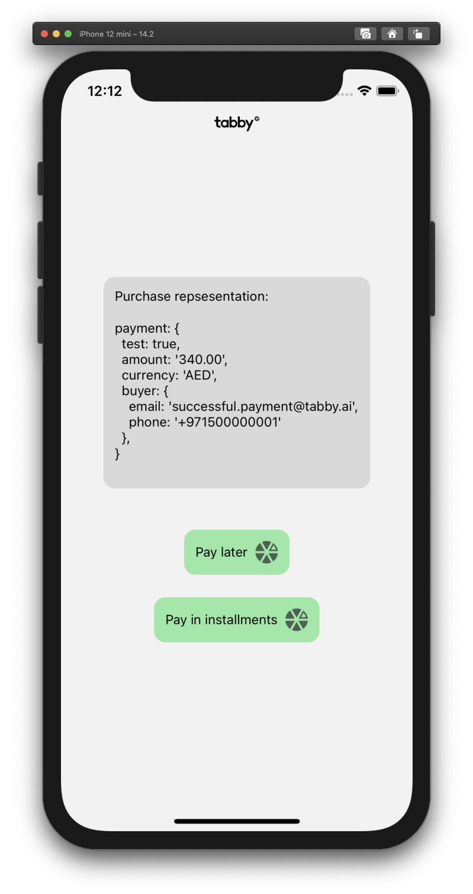
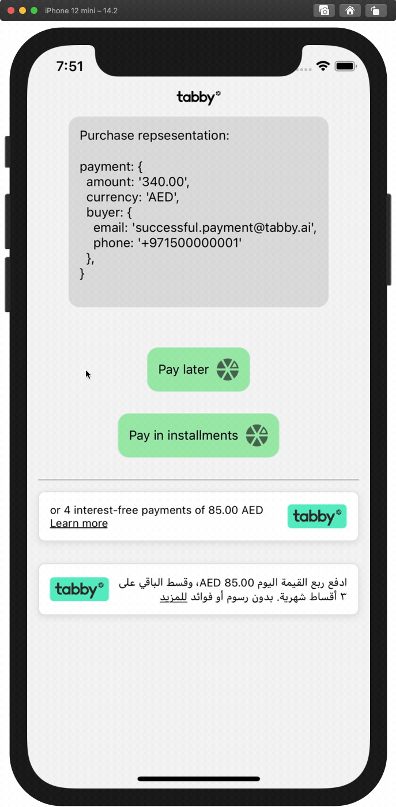

# Tabby checkout example app React Native 📱

## Requirements

> The only requirement is `react-native-webview`. So you can integrate Tabby checkout for both Expo and pure React Native apps

## Impelemtation

1. Let user decide to pay ether "Pay Later" or "Installments"
   

2. Create payment data

```
const mockPayment = {
  payment: {
    test: true,
    amount: '340.00',
    currency: 'AED',
    buyer: {
      email: 'successful.payment@tabby.ai',
      phone: '+971500000001',
    },
  },
};
```

> All the requred and optional fields are available here https://docs.tabby.ai/#operation/postCheckoutSession

3. Define your `tabbyApiKey` as a constant
4. Create checkout session by calling `fetch(`${tabbyApiHost}/checkout`)`
5. Let `react-native-webview` do it's job
6. Subscribe to messages emitted by webview and handle results

## Example

> Fully functional example:


## Snippets

1. in your navigation structure build a specific route (see `HomeStack.tsx` -> `ROUTES.SnippetWebView`)
2. Define your press handler

```typescript
const handleSnippetPress = (lang: 'en' | 'ar') => {
  navigation.navigate(ROUTES.SnippetWebView, {lang});
};
```

3. Just import and render the component

```typescript
<TabbySnippet
  lang="en"
  currency="AED"
  price="340"
  containerStyle={styles.withMargin}
  onPress={() => {
    handleSnippetPress('en');
  }}
/>
```

4. Place these snippets somewhere across the app as recommended by your integration manager
5. It will look like this
   

---

## How to run the example app?

1. `npm i`
2. `cd ios && pod install`
3. `npm run start:rc`
4. Open XCode, let project to be indexed, run with "Play" button
5. set `android/local.properties` sdk path like sdk.dir=/Users/your_username/Library/Android/sdk
6. Open Android Studio, let project to sync, run with "Play" button
7. Define your `tabbyApiKey` as a constant and follow **Impelemtation** steps above
